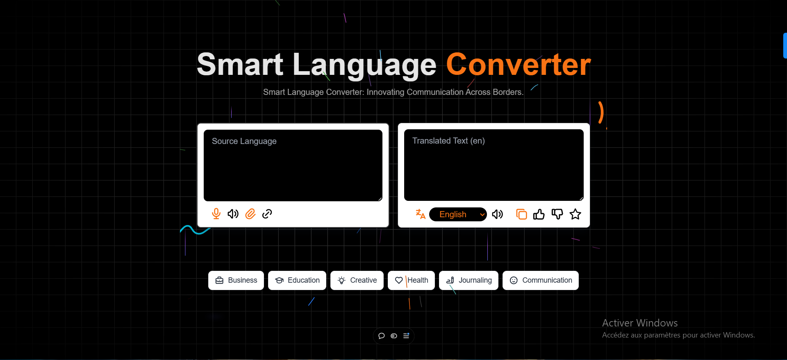

# **Translate App**

Welcome to the **Translate App**! This application is designed to help users translate text between multiple languages with various input methods, including manual text entry, speech recognition, file uploads, and URL pasting. The app also offers an audio playback feature for accurate pronunciation of the translated text.

Built with **React.js** and **Next.js**, the app provides a seamless and responsive user experience, optimized for all devices, including desktops, tablets, and smartphones.



## **Visit the App:** [Translate App](https://text-translate-ai.vercel.app/)

---

## **Table of Contents**

- [About the Project](#about-the-project)
- [Features](#features)
- [Components](#components)
- [Technologies Used](#technologies-used)
- [Installation](#installation)
- [Usage](#usage)
  - [Usage Examples](#Example-Use-Cases)
- [Contact](#contact)

---

## **About the Project**

The **Translate App** allows users to easily translate text from one language to another, while providing multiple input options and audio support for better usability. The app is built with modern technologies like **React.js** and **Next.js** for a smooth, fast, and responsive experience. It includes translation capabilities using third-party APIs, speech synthesis for pronunciation, and speech recognition for hands-free input.

The app is designed to support multiple languages and make translation accessible for users across different platforms.

---

## **Features**

- **Real-Time Text Translation:**
  - Instantly translate text from the source language to the target language.
  
- **Speech Recognition:**
  - Input text through voice commands and get real-time translations.
  
- **Audio Playback:**
  - Listen to the translated text with speech synthesis for accurate pronunciation.

- **File Upload:**
  - Upload text files and extract the content for translation.
  
- **Link Paste:**
  - Paste URLs to extract and translate text from web pages.

- **Favorites:**
  - Save your translated text for future reference with the ability to add/remove translations.

- **Language Selection:**
  - Select the source and target languages from a dynamic dropdown list.

- **Responsive Design:**
  - Fully optimized for all screen sizes, including desktops, tablets, and smartphones.

---

## **Components**

The **Translate App** is built using reusable React components. Below is a list of the key components:

1. **LanguageSelector**: Dropdown for selecting source and target languages.
2. **TextArea**: Provides the input and output fields for text translation.
3. **SpeechRecognitionComponent**: Captures voice input and converts it into text for translation.
4. **FileUpload**: Allows users to upload a text file and extract its contents for translation.
5. **LinkPaste**: Lets users paste URLs to fetch and translate text from web pages.
6. **AudioPlayback**: Reads out the translated text using speech synthesis.
7. **Favorites**: Stores and manages favorite translations in local storage.
8. **Loader**: Displays a loading spinner while the translation is in progress.

---

## **Technologies Used**

- **Frontend:**
  - **React.js**: A JavaScript library for building user interfaces.
  - **Next.js**: A framework for server-side rendering and static site generation.
  - **Tailwind CSS**: A utility-first CSS framework for fast UI development.

- **APIs:**
  - **Translation API**: A third-party API for text translations between multiple languages.
  - **Speech Recognition API**: For capturing voice input.
  - **Speech Synthesis API**: For audio playback of the translated text.

- **Utilities:**
  - **Axios**: For making HTTP requests to APIs.
  - **React Icons**: Provides icons for UI elements.

- **State Management:**
  - **React Context API**: For global state management across the app.

---

## **Installation**

To set up the project locally, follow these steps:

1. **Clone the repository:**
   ```bash
   git clone https://github.com/khalid-tourhzaoui/text-translate.git
   ```

2. **Navigate to the project directory:**
   ```bash
   cd khalid-tourhzaoui/text-translate
   ```

3. **Install dependencies:**
   ```bash
   npm install
   ```

4. **Start the development server:**
   ```bash
   npm run dev
   ```

5. Open your browser and go to `http://localhost:3000` to view the project.

## **Usage**

The **Translate App** offers multiple ways to interact with the translation system, including typing text, using speech recognition, uploading files, and pasting links. Here’s how to make the most of each feature:

### **Translate Text:**

- **Enter the Text:**
  Type or paste the text you want to translate into the **Source Language** text area.

- **Select Source and Target Languages:**
  Use the **Language Selector** dropdown to choose the language of the input text (source language).
  Select the language you want the text translated into (target language).

- **Translate the Text:**
  Click the **Translate** button or wait for the translation to happen automatically.

- **View Translated Text:**
  The translated text will appear in the **Target Language** text area.

- **Audio Playback:**
  Once the translation is complete, you can click the speaker icon to hear the translated text using speech synthesis.

---

### **Speech-to-Text Translation:**

- **Activate Speech Recognition:**
  Click the **microphone icon** in the source language text area. This activates voice input.

- **Dictate Your Text:**
  Speak clearly into your device's microphone. The app will convert your speech into text in the source language.

- **Automatic Translation:**
  After your speech is recognized, the app will automatically translate it into the selected target language.

- **Listen to the Translation:**
  You can listen to the translated text by clicking the speaker icon next to the translated text.

---

### **File Upload Translation:**

- **Upload a Text File:**
  Click the **Upload File** button in the app to choose a file from your computer (e.g., .txt file).

- **Extract Text from the File:**
  The app will read the contents of the file and automatically fill the source language text area with the extracted text.

- **Translate the Text:**
  The app will automatically translate the extracted text into the selected target language.

- **Audio Playback:**
  After the translation, you can click the speaker icon to hear the translated text.

---

### **Link Paste for Translation:**

- **Paste a URL:**
  Paste a link to a webpage that contains text you want to translate in the **Link Paste** input field.

- **Fetch and Extract Text:**
  The app will fetch the content from the URL and automatically extract the text to be translated.

- **Translation Process:**
  The app will then translate the text from the webpage into the selected target language.

- **Listen to the Translation:**
  As with the other methods, you can click the speaker icon to listen to the translated text.

---

### **Favorites Feature:**

- **Add a Translation to Favorites:**
  After translating text, click the **star icon** to add the translation to your favorites. The translated text will be saved in local storage for easy future access.

- **Remove from Favorites:**
  Click the **star icon** again to remove the translation from your favorites list.

---

### **Example Use Cases:**

#### **Example 1: Simple Text Translation**
- **Source Text:** "Good morning, how are you?"
- **Source Language:** English
- **Target Language:** Spanish
- **Translation:** "Buenos días, ¿cómo estás?"

#### **Example 2: File Upload Translation**
- **File Upload:** A .txt file with an article in English.
- **Source Language:** English
- **Target Language:** French
- **Translation:** "Bonjour, voici l'article traduit."

#### **Example 3: Voice Input Translation**
- **Speak into Microphone:** "Where is the nearest hospital?"
- **Source Language:** English
- **Target Language:** German
- **Translation:** "Wo ist das nächste Krankenhaus?"

#### **Example 4: URL Translation**
- **URL:** A webpage containing a news article in English.
- **Source Language:** English
- **Target Language:** Japanese
- **Translation:** "これは英語の記事です。日本語に翻訳しました。"

## **Contact**
- **Email:** [khalidtourhzaoui@gmail.com](mailto:khalidtourhzaoui@gmail.com)
- **LinkedIn :** [LinkedIn Profile](https://www.linkedin.com/in/khalid-tourhzaoui/)
- **My website:** [ Contact me](https://khalid-tourhzaoui.vercel.app/contactme)